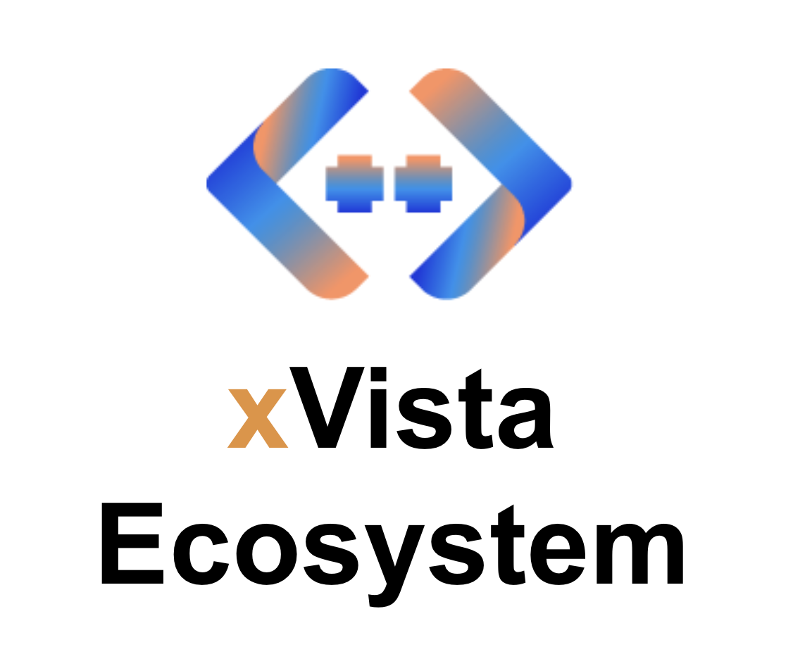

# AI-Powered Tool Suite

This repository contains a suite of tools powered by advanced AI models to assist in various tasks such as generating UML diagrams, translating documents, and converting meeting minutes into structured requirements.

## Agent Peter - Diagram Generator

Agent Peter is a web-based application built with Streamlit that leverages the power of OpenAI's GPT-4 to convert natural language instructions into PlantUML code, which is then used to generate UML diagrams. This tool is designed to help users quickly create diagrams from their ideas without the need to write PlantUML code manually.

### Features

- **Natural Language Processing**: Describe your diagram requirements in plain English and let the AI convert it to PlantUML code.
- **PlantUML Code Generation**: Automatically generates PlantUML code from the given instructions.
- **Custom Code Editing**: Edit the generated PlantUML code to fine-tune your diagram.
- **Real-Time Diagram Preview**: View the UML diagram that corresponds to your PlantUML code in real-time.
- **Diagram Download**: Download the generated UML diagram as a PNG image for use in documentation or presentations.

### How to Use

1. **Enter Instructions**: In the text area provided, describe your requirements for the UML diagram in natural language. For example, "Help me create an instruction on how to bake a brownie."
2. **Generate Code**: Click the 'Convert to PlantUML' button to have the AI convert your instructions into PlantUML code. If an error occurs, try pressing the button again.
3. **Edit Code (Optional)**: If necessary, you can edit the generated PlantUML code directly in the text area that appears below the button.
4. **Download Diagram**: Once the code is finalized, the application will automatically generate and display the UML diagram. You can then download the diagram using the 'Download image' button.

### Output Example

Below is an example of a UML diagram generated by AI Agent:

## Agent Philip - Document Translator

Agent Philip is a powerful document translation tool that supports multiple file formats including PowerPoint, Word, and Excel documents. It utilizes advanced AI to accurately translate content into various languages, streamlining the process of preparing multilingual documents.

### Features

- **Multiple File Format Support**: Translate PowerPoint, Word, and Excel files.
- **Advanced Language Models**: Powered by the latest AI technology for accurate translations.
- **Progress Tracking**: Real-time updates on translation progress.
- **Download Translated Documents**: Easily download the translated versions of your documents.

### How to Use

1. **Upload a Document**: Choose the document file (PPTX, DOCX, or XLSX) you wish to translate.
2. **Select Language**: Choose or enter the target language for translation.
3. **Translate**: Click the 'Translate' button to start the translation process.
4. **Download**: After translation, download the translated document using the provided button.

## Agent Simon - Minutes to Requirements

Agent Simon transforms meeting minutes into structured software requirements documents. This tool is invaluable for project managers and developers by providing a clear, actionable plan from meeting discussions.

### Features

- **Extract Insights**: Converts raw text from meeting minutes into structured formats.
- **Generate Various Outputs**: Creates requirement plans, use case tables, workflows, and more.
- **Interactive Interface**: Offers a user-friendly interface to input data and review outputs.

### How to Use

1. **Upload Meeting Transcript**: Upload the document containing the meeting transcript.
2. **Generate Requirements**: Click the 'Generate Requirement Plan' button to process the transcript.
3. **Review and Refine**: Review the generated requirements and refine them using additional tools provided in the sidebar.

## Setup

To run these tools locally, you will need:

- Java Runtime Environment (JRE) installed on your machine to run the PlantUML .jar file for Agent Peter.
- An OpenAI API key with access to GPT-4 models for all agents.
- Streamlit installed to run the applications.

## Troubleshooting

If you encounter any issues while using the applications:

- Ensure that your OpenAI API key is correctly set up within the Streamlit secrets for each agent.
- Check that the PlantUML .jar file path is correctly specified in the application for Agent Peter.
- If any errors occur during diagram generation or document translation, try regenerating the code or editing the inputs manually.

## Contributions

Contributions to this suite are welcome! If you have suggestions for improvements or bug fixes, please feel free to create an issue or pull request on the repository.

## License

This project is licensed under the MIT License. See the [LICENSE](LICENSE) file for details.

Thank you for using our AI-Powered Tool Suite - happy productivity!
